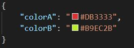

# JSON color token

This repo implements a language server for VSCode. The language server can be installed as an extension. The extension enables hex color token detection in JSON files, provides color preview and color editing through the built-in color picker.

## Example

A json file with hex color tokens

```json
{
	"colorA": "#DB3333",
	"colorB": "#B9EC2B"
}
```

will be rendered as




## Features

- Preview visual color from hex color tokens
- Adjust color using the built-in color picker